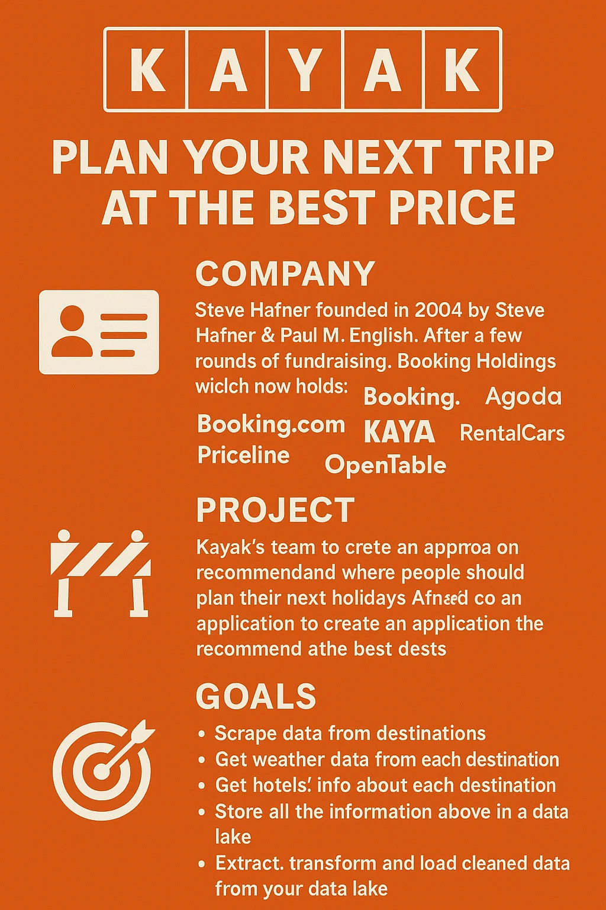

# kayak

Bloc1 : Construction et alimentation d'une infrastructure de gestion de données (Build &amp; Manage a Data Infrastructure).



Il s'agit du projet public sur GitHub : [https://github.com/pradelf/kayak](https://github.com/pradelf/kayak).

La version web du projet est consultable à l'url : <https://dd0kljvyoc0fk.cloudfront.net>

Le stockage S3 des données est dans le "Bucket" [https://francis-pradel-jedha-projects.s3.eu-west-3.amazonaws.com/att/francis-pradel-jedha-projects/kayak](https://francis-pradel-jedha-projects.s3.eu-west-3.amazonaws.com/att/francis-pradel-jedha-projects/kayak)

## Sujet du projet d'évaluation

L’équipe marketing de Kayak a besoin d’aide pour un nouveau projet. Après avoir mené une étude auprès des utilisateurs, l’équipe a découvert que 70 % des utilisateurs qui prévoient un voyage souhaitent obtenir plus d’informations sur leur destination.

De plus, l’étude montre que les gens ont tendance à se méfier des informations qu’ils lisent s’ils ne connaissent pas la marque qui a produit le contenu.

Par conséquent, l’équipe marketing de Kayak souhaite créer une application qui recommandera aux utilisateurs où planifier leurs prochaines vacances. L’application devra se baser sur des données réelles concernant :

La météo
Les hôtels dans la région
L’application devra ensuite être capable de recommander les meilleures destinations et les meilleurs hôtels en fonction de ces variables, à tout moment.

## Evaluation

| Numéro du bloc| Nom du bloc (Français)|Nom du bloc (Anglais) |Projets* | Durée durant l'examen de certification |
| :---------------: |:---------------:| :--------:|:---------------:|:---------------:|
|1 |Construction et alimentation d'une infrastructure de gestion de données|Build & Manage a Data Infrastructure |Présenter 1 projet  - Fullstack Data Science - Data Collection & Management Project (Projet Kayak) |10 minutes réparties comme suit : - 5 minutes de présentation - 5 minutes de questions-réponses |

## Execution du projet

En premier lieu, la liste des villes ou lieux cibles pour un projet de vacances est créée.
Puis pour chacun d'eux;  nous récupérons leur coordonnées GPS grâce à l'API web service de nomitim.

## Process you have in mind for the project : Kayak

For a project like Kayak, it might look something like this:

 [ ]  Use a geolocalisation API to get latitude and longitude for my list of cities (such as nominatim)
 [ ] Use a weather API to get weather information on my cities, thanks to the coordinates (such as open weather api)
 [ ] Use my weather information to select the 5 most attractive cities for a holiday
 [ ]Use Scrapy to scrape booking.com information on 25 information for each city
 [ ] Upload all my raw data to an S3 bucket using boto3
Retrieve the data locally using boto3
 [ ] Clean and structure the data into a tabular format with python and pandas
 [ ] Upload my tabular data to an RDS with sqlalchemy
Run a few SQL requests on my data using sqlalchemy

## Processus envisagé pour le projet : Kayak

Pour un projet comme Kayak, le déroulé pourrait ressembler à ceci :

 [ ] Utiliser l'API de géolocalisation Nominatim pour obtenir la latitude et la longitude de la liste de villes.
 [ ] Utiliser l'API météo pour récupérer les informations météorologiques des villes à partir de leurs coordonnées. J'ai choisi le service météo : open-meteo. Il est plus facile d'usage qu'OpenWeather sans obligation de création de compte.
 [ ] Utiliser ces données météo pour sélectionner les 5 villes les plus attractives pour des vacances.
 [ ] Utiliser Scrapy pour extraire les informations de booking.com sur 25 hôtels par ville.
 [ ] Téléverser toutes les données brutes dans un bucket S3 à l’aide de Boto3.
 [ ] Récupérer les données localement avec Boto3.
 [ ] Nettoyer et structurer les données en format tabulaire avec Python et Pandas.
 [ ] Téléverser les données tabulaires dans une base AWS RDS via SQLAlchemy.
 [ ] Exécuter quelques requêtes SQL sur ces données à l’aide de SQLAlchemy.

## Objectifs concrets

🧰 Quels outils utilisés :

* Scrapy
* XPath (requêtage XML)
* AWS S3
* AWS Boto 3
* AWS CDK
* Pandas
* Postgresql
* Neon pour les bases postgresql

🔄 Quels processus mettre en place :

* Scrapping du site booking.
* analyse et mise en place de la consommation du web service : open-meteo
* structuration de données et envoie dans un compartiment (Bucket) AWS S3
* Création d'une base de données et insertion de données
* Création d'une application pour consommer notre projet
* Création d'un environnement serveless AWS pour limiter les coûts avec CDK.

❓ Quelles questions se pose ?

* Quels sont les meilleures destination dans les 5 prochains jours de vacances en fonction de la météo ?
* Qu'est-ce qu'une bonne météo usuellement constatée ?
* Quels sont les hôtels autour de la destination dans Booking ?

⚙️ Quels problèmes résoudre ?

* Phasage des requête de fonctions de web service pour obtenir la destination (météo, coordonnées GPS) puis interrogation et scrapping du site booking.
* Le plus difficile est l'analyse et le décorticage(Scrapping) du site Booking pour obtenir le liste des hôtels de destination du voyage.

📁 Quels fichiers précis rendre pour l’obtention de la certification ?

* notebook de description du processus
* codage python du scrapping avec Scrapy
* base de données avec des données sur neondb
* fichier des données obtenues.

## CRÉATION DE L'ENVIRONNEMENT CLOUD SUR AWS AVEC CDK

CDK  est une librairie dont nous avons ici choisi la version en Python pour créer une infrstructure Cloud en la décriavnt comme du code (IaC : Infrastructure as Code spécifique à AWS).

Nous créons le code de base (boilerplate) en utilisant la commande d'initialisation de projet en nous plçant dans le repertoire App que nous allons dédié à notre application Web.

```bash
cd App
cdk init app --language=python
```

Nous sommes accueilli après le lancement de la commande par le message suivant  qui explique l'usage de CDK pour AWS.
___

### Welcome to your CDK Python project

This is a blank project for CDK development with Python.

The `cdk.json` file tells the CDK Toolkit how to execute your app.

This project is set up like a standard Python project.  The initialization
process also creates a virtualenv within this project, stored under the `.venv`
directory.  To create the virtualenv it assumes that there is a `python3`
(or `python` for Windows) executable in your path with access to the `venv`
package. If for any reason the automatic creation of the virtualenv fails,
you can create the virtualenv manually.

To manually create a virtualenv on MacOS and Linux:

```
python3 -m venv .venv
```

After the init process completes and the virtualenv is created, you can use the following
step to activate your virtualenv.

```
source .venv/bin/activate
```

If you are a Windows platform, you would activate the virtualenv like this:

```
% .venv\Scripts\activate.bat
```

Once the virtualenv is activated, you can install the required dependencies.

```
pip install -r requirements.txt
```

At this point you can now synthesize the CloudFormation template for this code.

```
cdk synth
```

To add additional dependencies, for example other CDK libraries, just add
them to your `setup.py` file and rerun the `pip install -r requirements.txt`
command.

#### Useful commands

* `cdk ls`          list all stacks in the app
* `cdk synth`       emits the synthesized CloudFormation template
* `cdk deploy`      deploy this stack to your default AWS account/region
* `cdk diff`        compare deployed stack with current state
* `cdk docs`        open CDK documentation

Enjoy!
___
La version web du projet est consultable à l'url : <https://dd0kljvyoc0fk.cloudfront.net>
