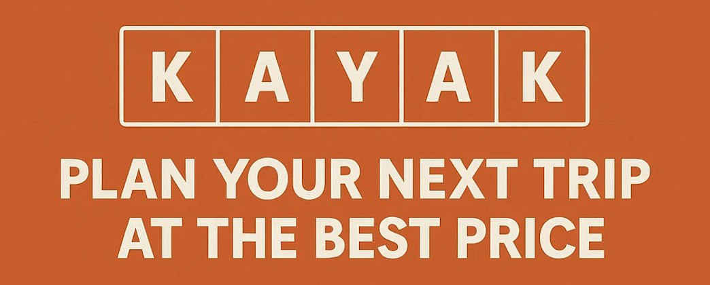

# kayak
Bloc1 : Construction et alimentation d'une infrastructure de gestion de données (Build &amp; Manage a Data Infrastructure).

## Sujet du projet d'évaluation : 
L’équipe marketing de Kayak a besoin d’aide pour un nouveau projet. Après avoir mené une étude auprès des utilisateurs, l’équipe a découvert que 70 % des utilisateurs qui prévoient un voyage souhaitent obtenir plus d’informations sur leur destination.

De plus, l’étude montre que les gens ont tendance à se méfier des informations qu’ils lisent s’ils ne connaissent pas la marque qui a produit le contenu.

Par conséquent, l’équipe marketing de Kayak souhaite créer une application qui recommandera aux utilisateurs où planifier leurs prochaines vacances. L’application devra se baser sur des données réelles concernant :

La météo
Les hôtels dans la région
L’application devra ensuite être capable de recommander les meilleures destinations et les meilleurs hôtels en fonction de ces variables, à tout moment.
## Evaluation

| Numéro du bloc| Nom du bloc (Français)|Nom du bloc (Anglais)	|Projets* | Durée durant l'examen de certification |
| :---------------: |:---------------:| :--------:|:---------------:|:---------------:|
|1	|Construction et alimentation d'une infrastructure de gestion de données|Build & Manage a Data Infrastructure	|Présenter 1 projet  - Fullstack Data Science - Data Collection & Management Project (Projet Kayak)	|10 minutes réparties comme suit : - 5 minutes de présentation - 5 minutes de questions-réponses |

## Execution du projet.

En premier lieu, la liste des villes ou lieux cibles pour un projet de vacances est créée.
Puis pour chacun d'eux;  nous récupérons leur coordonnées GPS grâce à l'API web service de nomitim.

